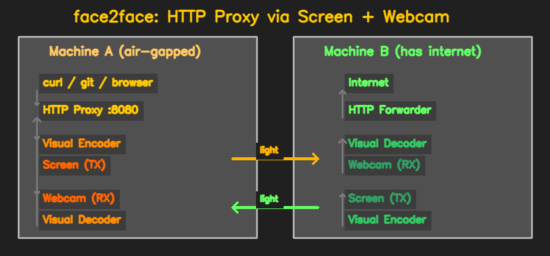
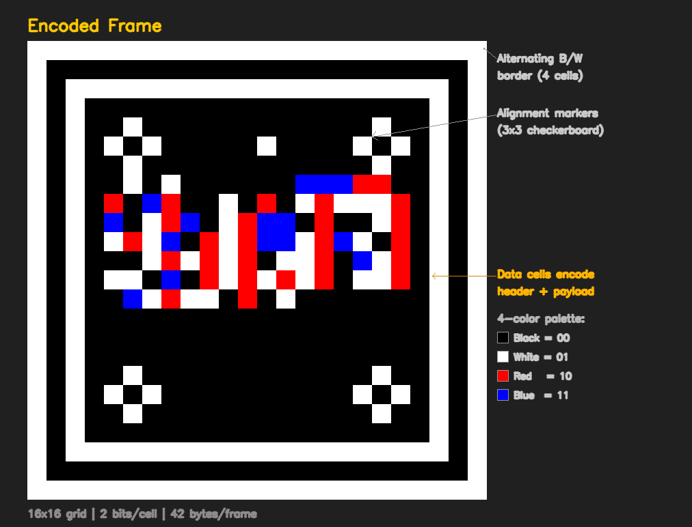
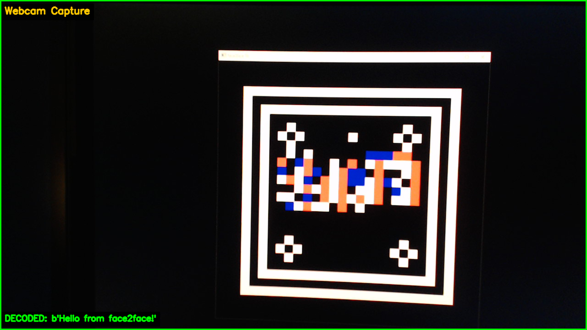
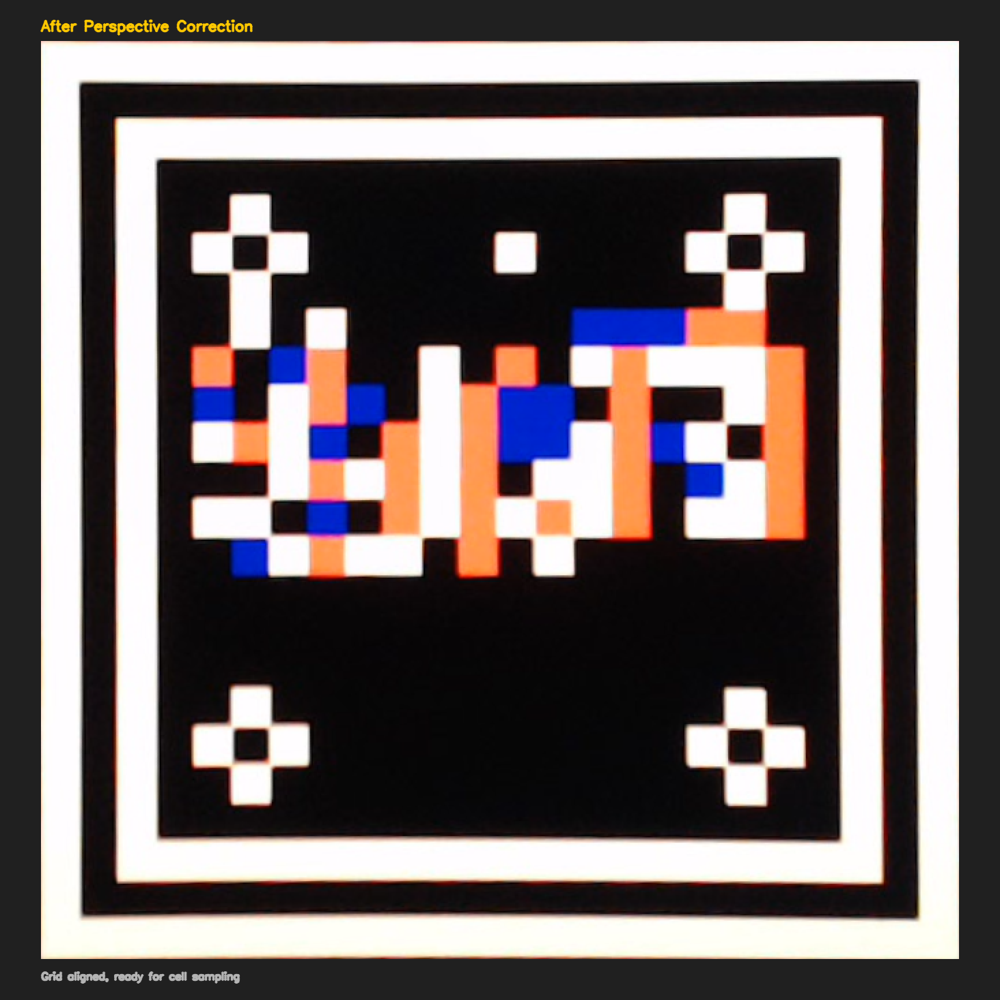
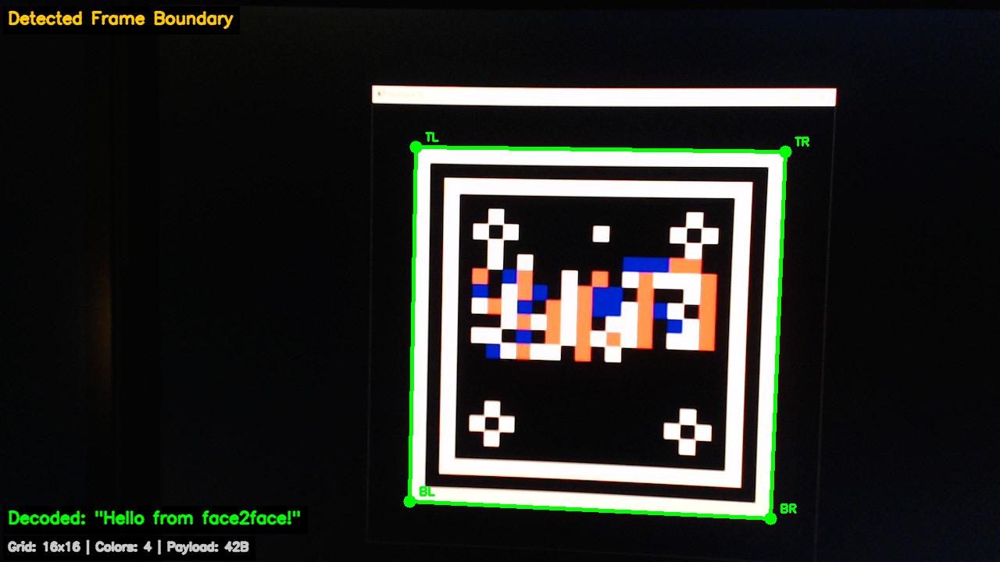

# face2face

An HTTP proxy that communicates through screens and webcams. It encodes HTTP traffic into visual frames displayed on a screen, which are captured by a webcam on another machine, decoded, and forwarded to the internet.

Two machines, two webcams, two screens -- no network cable required.



## How it works

**Machine A** (air-gapped, no internet) runs an HTTP proxy on `localhost:8080`. When an app like `curl` or `git` makes a request, the proxy encodes it into a colored grid and displays it on screen.

**Machine B** (has internet) watches Machine A's screen with a webcam, decodes the request, makes the real HTTP call, then encodes the response and displays it on *its* screen for Machine A's webcam to pick up.

The visual link uses:
- A **color grid** where each cell encodes 2-6 bits (4 to 64 colors)
- **Alignment markers** in the corners for perspective correction
- **Adaptive palette calibration** to handle color shifts from different screens/cameras
- **Reed-Solomon error correction** to recover from misread cells
- **ARQ flow control** with ACK/NACK for reliable delivery

### Encoding

Binary data is packed into a grid of colored cells. Each cell represents 2 bits using 4 high-contrast colors. An alternating black/white border and 3x3 checkerboard markers in each corner enable the decoder to find and correct the frame from any angle.



### Capture and decode

The webcam captures the screen, finds the frame boundary, and applies a perspective transform to straighten the grid. The decoder calibrates its color palette from the known marker cells, then reads each data cell.

| Webcam capture | Perspective corrected |
|:-:|:-:|
|  |  |

The detected quad (green outline) is used to warp the image back to a clean rectangle, aligning the grid for cell-by-cell sampling.



## Quick start

```bash
# Install
pip install -e ".[dev]"

# Run the automated test suite (no hardware needed)
pytest tests/ -v
```

### Real webcam-at-screen test (single machine)

```bash
# Check webcam works
python tools/webcam_check.py

# Display an encoded frame and decode it live with the webcam
python tools/live_decode_test.py
```

### Full proxy (two machines)

```bash
# Machine B (has internet):
face2face server

# Machine A (air-gapped):
face2face client --port 8080

# Then on Machine A:
export http_proxy=http://localhost:8080
curl http://httpbin.org/get
```

## Project structure

```
face2face/
  visual/          # Frame encoding/decoding, screen rendering, webcam capture
    codec.py       #   Color grid codec (encode/decode binary <-> color cells)
    decoder.py     #   Frame detection + perspective correction from camera images
    renderer.py    #   Screen display with OpenCV
    capture.py     #   Webcam capture
    camera_sim.py  #   Realistic camera degradation simulator (for tests)
    ecc.py         #   Reed-Solomon error correction
  protocol/        # Link-layer protocol
    framing.py     #   Message chunking and reassembly
    flow.py        #   ARQ flow control (stop-and-wait / sliding window)
    link.py        #   Unidirectional visual link manager
    channel.py     #   Bidirectional multiplexed channel
  proxy/           # HTTP proxy layer
    server.py      #   HTTP/HTTPS proxy server (Machine A)
    forwarder.py   #   HTTP request forwarder (Machine B)
    serialization.py # Compact binary serialization for HTTP messages
  compression/     # Payload compression (zlib + header dictionary)
  cli/             # CLI entry points (client, server, calibrate, benchmark)
tools/             # Real-hardware test and diagnostic scripts
tests/             # Automated test suite (112 tests, no hardware needed)
```

## Configuration

Settings are stored in `~/.config/face2face/config.toml`:

```toml
[visual]
grid_cols = 16        # grid size (16x16 = conservative, 32x32 = more data)
grid_rows = 16
bits_per_cell = 2     # 2 = 4 colors (robust), 4 = 16 colors (faster)
cell_px = 28          # pixel size per cell

[camera]
camera_index = 0
camera_width = 1280
camera_height = 720

[renderer]
frame_hold_ms = 500   # display time per frame
blank_hold_ms = 100   # sync gap between frames

[error_correction]
ecc_nsym = 20         # Reed-Solomon redundancy symbols
```

## Performance

| Setting | Conservative | Optimistic |
|---------|-------------|-----------|
| Grid | 16x16 | 48x48 |
| Colors | 4 (2-bit) | 16 (4-bit) |
| Bytes/frame | 42 | 1,152 |
| Frame rate | 2 fps | 10 fps |
| **Throughput** | **~60 B/s** | **~10 KB/s** |

At conservative settings, small HTTP responses return in seconds. Larger transfers (cloning a repo, downloading files) are slow but functional -- this is designed for air-gapped environments where *any* connectivity is valuable.

## Tests

All 112 tests run without any camera hardware:

```bash
pytest tests/ -v                        # full suite
pytest tests/test_camera_sim.py -v      # camera degradation simulation
pytest tests/test_geometry.py -v        # off-axis rotation/keystone
pytest tests/test_integration.py -v     # full proxy stack (loopback)
pytest tests/test_visual_roundtrip.py -v # encode -> save -> load -> decode
```

## Tools

| Script | Purpose |
|--------|---------|
| `tools/webcam_check.py` | Verify webcam is accessible |
| `tools/live_decode_test.py` | Live encode-display-capture-decode loop |
| `tools/decode_diagnose.py` | Step-by-step decode diagnostic |
| `tools/capture_readme_images.py` | Generate the images in this README |

See [REAL_TEST_GUIDE.md](REAL_TEST_GUIDE.md) for detailed single-machine and WSL2 setup instructions.
